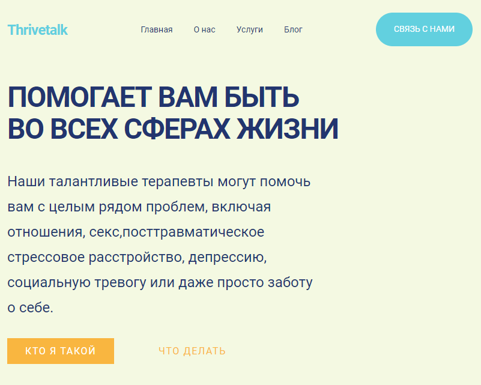

# Thrivetalk
Лендниг компании занимающейся лечением психического здоровья граждан. Проект разработан в учебных целях, для тренировки навыков адаптивной вёрстки.

## Содержание
- [Технологии](#технологии)
- [Начало работы](#начало-работы)
- [Разработка](#разработка)
- [Содействие](#содействие)
- [Вопросы](#вопросы)
- [Список задач](#список-задач)
- [Команда проекта](#команда-проекта)
- [Источники](#источники)

## Технологии
- [HTML5](https://developer.mozilla.org/en-US/docs/Web/HTML)
- [CSS3](https://developer.mozilla.org/en-US/docs/Web/CSS)
- [JQuery](https://jquery.com/)
- [JavaScript](https://developer.mozilla.org/en-US/docs/Web/JavaScript)
- [Google Fonts](https://fonts.google.com/)

## Начало работы
На GitHub.com перейдите на главную страницу репозитория, затем:
1. Над списком файлов щелкните Code.
2. Скопируйте URL-адрес репозитория. (Чтобы клонировать репозиторий по протоколу HTTPS, в разделе "HTTPS" щелкните)
3. Откройте cmd и выполните команду git clone <URL-адрес репозитория>
4. Откройте проект в любом редакторе кода
5. Запустите html файл с помощью редактора

## Разработка

### Требования
Для установки и запуска проекта желательно скачать любой редактор кода.

### Установка зависимостей
Не требуется.

## Содействие
Если вам понравились мои работы, и у вас есть вопросы, идеи, предложения о сотрудничестве, напишите мне в любом мессенджере, и я обязательно вам отвечу.

## Вопросы
Здесь вопросы о частых ошибках.

### Зачем вы разработали этот проект?
Для учебной практики.

### Почему так мало коммитов?
К сожалению, на момент написания, я мало знал про git и github в целом.

## Список задач
- [x] Добавить README
- [x] Добавить cursor: pointer
- [ ] Предложите своё?

## Команда проекта

- [Расул Султанбеков](https://github.com/rasul-surname) — Front-End Developer

## Источники
Макет figma из открытого источника.
